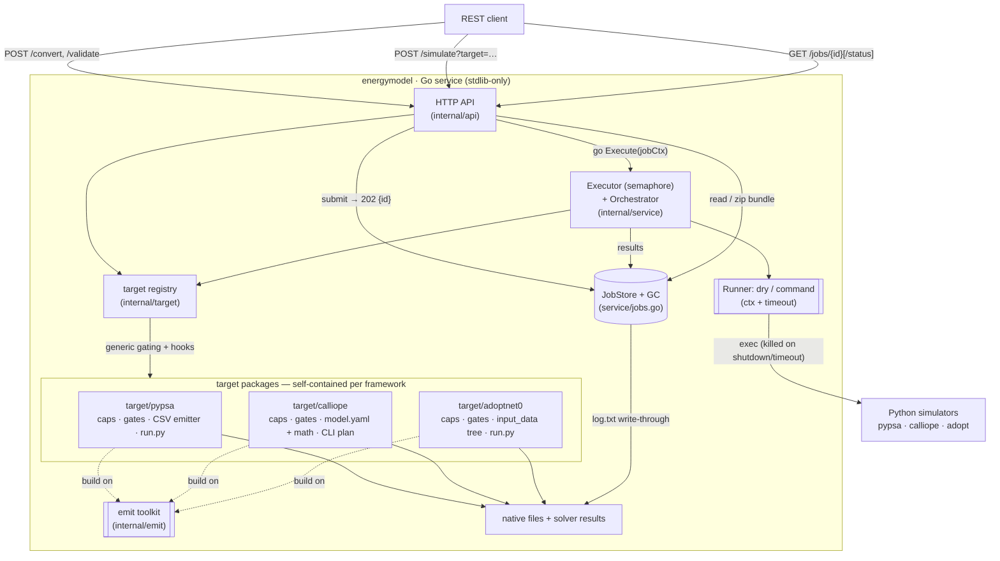
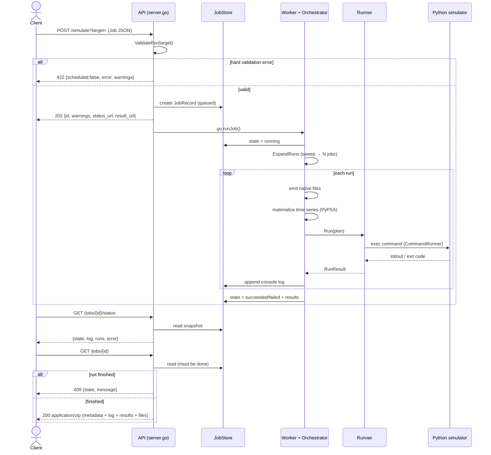
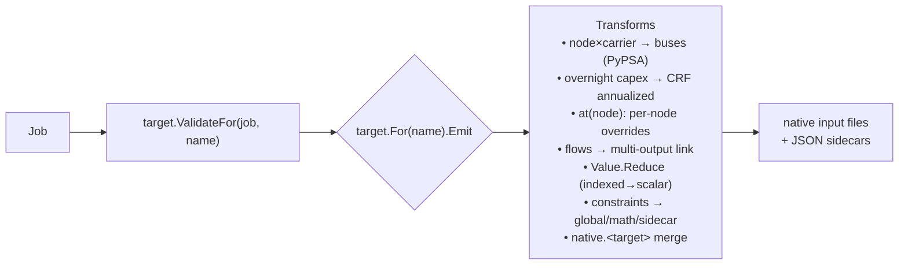
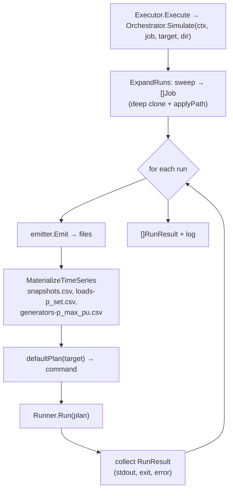

# Multi Energy Model Execution (MEME)

A dependency-free (Go standard library only) REST service that accepts one
**canonical JSON model** and translates it into the native input formats of three
energy-system optimization frameworks — **PyPSA**, **Calliope 0.7**, and
**AdOpT-NET0** — then optionally runs the simulation and returns a zipped result
bundle. A request targets **one framework, a subset, or all three at once**
(`?target=pypsa`, `?target=pypsa,calliope`, `?target=all`); a multi-target job
emits, executes and solves every requested model and bundles them in one zip.
The Go service is a pure, stateless **translator + orchestrator**; the actual
solvers are external Python processes it hands work to.

## Quickstart

**Dry-run on the host** (Go only, no Python — validates, translates and plans,
but does not solve):

```bash
make run                                    # build + serve on :8080
curl -s -X POST 'localhost:8080/validate?target=all' \
     -d @examples/shared_full.json | jq .   # per-target verdicts
curl -s -X POST 'localhost:8080/convert?target=calliope' \
     -d @examples/calliope_full.json | jq . # emit the native model to disk
```

**Real solvers in Docker** (PyPSA/HiGHS, Calliope/CBC, AdOpT/GLPK — nothing to
install on the host beyond Docker):

```bash
make -C environment build ENV=dev           # one-time image build
make -C environment run   ENV=dev           # API on :8080, real execution

ID=$(curl -s -X POST 'localhost:8080/simulate?target=all' \
     -d @examples/shared_full.json | jq -r .id)          # 202, async job
curl -s "localhost:8080/jobs/$ID/status" | jq .state     # queued->running->succeeded
curl -s -o result.zip "localhost:8080/jobs/$ID"          # results + config + files + logs
```

The full request walkthrough (single- and multi-target, every run mode, seeing
a 422 rejection) is in [`examples/README.md`](examples/README.md).

## Setup

**Requirements.** Host build: Go ≥ 1.22 and `make`. Real solver execution:
Docker with compose v2 — the [`environment/`](environment/) image carries
Python 3.12, the three frameworks and their solvers (the framework versions
are exact-pinned and load-bearing; the solvers ride on `highspy`/apt without
pins — see [`environment/README.md`](environment/README.md)).

**Configuration** — precedence **CLI flag > `.env` > built-in default**
(copy [`.env.example`](.env.example) to `.env`, or point elsewhere with
`-env-file` / `MEME_ENV_FILE`):

| `.env` key | Flag | Default | Meaning |
|---|---|---|---|
| `PORT` / `ADDR` | `-addr` | `:8080` | listen port (`ADDR=host:port` wins over `PORT`) |
| `WORK` | `-work` | OS temp | root dir for emitted files and job dirs |
| `EXEC` | `-exec` | `false` | run real solvers vs. dry-run |
| `API_KEY` | `-api-key` | *(empty)* | require this key in every payload; empty = auth off |
| `CORS_ORIGINS` | `-cors-origins` | *(empty)* | comma-separated browser origins allowed via CORS; empty = CORS off |

**Authentication.** Set `API_KEY` and every payload-bearing request
(`/validate`, `/convert`, `/simulate`) must carry it as a top-level
`"api_key"` field in the JSON body or it is rejected with a 401
`{"error":…}`. When `API_KEY` is not set (the default), no key is requested
and any key a client sends is simply accepted. The key is compared in
constant time, never logged, and **redacted from the `config.json` persisted
into the result bundle**; keyless payloads still round-trip byte-identical.
The `GET /jobs/{id}` endpoints carry no payload — they are addressed by
unguessable 128-bit random job ids known only to the submitter.

The example payloads in [`examples/`](examples/) already ship a top-level
`"api_key": "s3cret"`, so they post verbatim against a server started with the
matching key. For a different key, edit the field (e.g. `jq '.api_key="…"'`);
when `API_KEY` is unset the field is ignored.

```bash
echo 'API_KEY=s3cret' >> .env && make run
curl -s -X POST 'localhost:8080/validate?target=pypsa' -d @examples/pypsa_full.json
```

**CORS.** Off by default: no `Access-Control-*` headers are emitted and
cross-origin browser calls stay blocked. Set `CORS_ORIGINS` to a
comma-separated allow list — exact origins (`https://app.example.com`), the
wildcard `*`, or subdomain wildcards (`https://*.example.com`) — and the
server answers preflight `OPTIONS` on every route (204, before
authentication: preflights carry no payload and hence no `api_key`), echoes
the allowed origin on responses, and exposes `Content-Disposition` so
browser JS can read the zip filename from `GET /jobs/{id}`. Combining `*`
with credentials is rejected at startup, as are malformed origins (e.g. a
trailing slash). Embedders constructing `api.Server` directly get the full
knob set via `api.CORSConfig`: custom methods/headers, credentials,
preflight max-age, Chrome private-network preflights, and an
`AllowOriginFunc` escape hatch. Note CORS is browser policy, not access
control — non-browser clients ignore it; `API_KEY` remains the
authentication.

```bash
echo 'CORS_ORIGINS=http://localhost:5173' >> .env && make run
curl -si -X OPTIONS 'localhost:8080/validate?target=pypsa' \
  -H 'Origin: http://localhost:5173' -H 'Access-Control-Request-Method: POST'
# HTTP/1.1 204 No Content, Access-Control-Allow-Origin: http://localhost:5173, …
```

## Repository overview

```
.
├── cmd/meme/                server main: config wiring, solver timeouts, job GC,
│                            graceful shutdown (kills running solvers)
├── internal/
│   ├── api/                 HTTP transport: routing (+/v1 alias), multi-target
│   │                        resolution, api_key auth, JSON error envelope, zip download
│   ├── cli/                 flag/.env resolution (CLI > .env > default)
│   ├── env/                 dependency-free .env file parser
│   ├── model/               canonical schema + structural validation (framework-neutral)
│   ├── emit/                shared emission toolkit: CSV/JSON writers, CRF math,
│   │                        time-series helpers, native-block merging
│   ├── scripts/             Python driver scripts (pypsa_run.py, adoptnet0_run.py),
│   │                        embedded and exported for the target plugins
│   ├── target/              target registry + capability-driven validation pipeline
│   │   ├── pypsa/           plugin: gates, CSV emitter, embedded run.py driver
│   │   ├── calliope/        plugin: gates, model.yaml + custom math, CLI run plan
│   │   ├── adoptnet0/       plugin: gates, input_data tree, embedded run.py driver
│   │   ├── all/             blank-import umbrella that registers the three plugins
│   │   └── testdata/golden/ emitter snapshots + frozen validation matrix
│   ├── scenarios/           embedded corpus: 38 runnable payloads + shared sample
│   └── service/             Executor (bounded concurrency), Orchestrator (sweep →
│                            emit → run), Runners (dry / command+timeout),
│                            JobStore + GC, result-zip bundling
├── test/                    test pyramid docs + Makefile; test/e2e/ = real-solver suite
├── environment/             Docker image, compose, per-env .env files, pinned
│                            framework requirements (see environment/README.md)
├── examples/                maximal + shared payloads with the curl walkthrough
├── schemas/                 CAPABILITY.md (shared schema, per-framework natives,
│                            property tables), the published JSON Schemas
│                            (revised_unified_schema.json = the payload contract,
│                            checked by `make schema-check`), schema-vs-Go report
├── docs/                    mkdocs site (template scaffolding + assets)
├── Makefile                 build/run; delegates to test/ and environment/
└── .env.example             annotated configuration template
```

Each **target plugin** is self-contained (capability profile, validation
gates, emitter, run plan) and self-registers; adding a fourth framework means
one new package under `internal/target/` plus one blank import.

Ready-to-run example payloads live in [`examples/`](examples/): one **maximal**
config per framework (every supported property), plus `shared_full.json` and
`payload_full.json` — configs valid for **all three frameworks at once**, the
latter carrying pypsa+calliope+adopt native blocks side by side — together with
the full curl walkthrough (validate → convert → simulate → poll → zip,
single- and multi-target).

## Testing

```bash
make test           # vet + all unit/integration tests on the host (no Python)
make test-race      # race-detector pass over the concurrent packages
make schema-check   # examples/ + scenario corpus vs schemas/revised_unified_schema.json (python3 + jsonschema)
make e2e-smoke      # container: 3 real-solver lifecycles + one multi-target job (~1 min)
make e2e            # container: the full corpus on real solvers (~1.5 min)
make golden-update  # accept an intended emitter/validation change into the goldens
```

The suite is a pyramid: golden-file emitter snapshots and a frozen validation
matrix catch most regressions **without solvers, in milliseconds**; the
container tiers certify real execution end-to-end (native files on disk,
solver optimal, complete zip bundle, pinned objective values). The full tour —
what each layer covers, the golden workflow, how to add a scenario, fuzzing —
is in [`test/README.md`](test/README.md).

Worked example payloads for every framework's use cases (generators, conversion,
storage, transmission, trade with fixed and time-varying prices, unit commitment
(PyPSA UC + Calliope MILP), emission limits, scoped + unscoped linear
constraints, custom math, SPORES / MGA, operate (Calliope receding horizon +
PyPSA rolling horizon), two-stage stochastic, physics/climate, per-node
overrides, precomputed physics, multi-output CHP with rigid ratios, piecewise
part-load performance, resampling, Pareto / Monte-Carlo / typical-days runs)
live in [`internal/scenarios/testdata/scenarios/`](internal/scenarios/testdata/scenarios/) and are
exercised by `TestScenarios` (validate + emit) and by the E2E suite (each
scenario runs to optimal on its real solver). `TestCapabilityCoverage` enforces
that every capability the matrix claims is backed by one of these scenarios —
an unbacked claim fails the build. See the
[scenario catalog](#9-test-scenario-catalog) in §9 for the full list.
`TestAdoptRunModeConfig` additionally parses the emitted `ConfigModel.json` to
prove the Pareto/Monte-Carlo/typical-days modes reach AdOpT's solve
configuration.

---

# Architecture

## 1. System architecture



**Colour of responsibility.** Everything inside `Service` is deterministic Go.
Each **target package** is a self-contained plugin (capability profile,
validation gates, emitter, run plan) registered with the **target registry**,
which owns the generic capability-driven validation. The **emit toolkit** is
the shared file-writing vocabulary the targets build on. The **Executor**
bounds solver concurrency and threads the server-lifetime context into every
solver process; the **JobStore** is the only shared mutable state (logs
write-through to disk, finished jobs are garbage-collected). The **Python
simulators** are the only external processes.

---

## 2. Component catalog

| Package / file | Component | Responsibility |
|---|---|---|
| `internal/model` | canonical structs, `Model.Validate`, `Value`, constraint IR, `Performance`, `Native`, `Feature` | The framework-neutral vocabulary: JSON schema, structural + referential validation, shared feature names. Knows no target specifics. |
| `internal/emit` | `WriteCSV`, `WriteJSON`, `Ftoa`, `ValScalar`/`ScalarOr`/`OptFloat`, `AnnualizedCapex`, series helpers, native merge | Shared emission toolkit the target packages build on (CRF math, deterministic writers, native passthrough merging). |
| `internal/target` | `Target` interface, `Register`/`For`/`Names`, `ValidateFor`, `CapabilityMatrix`, `RunPlan` | The registry: resolves targets, aggregates capability profiles, and orchestrates validation (structural → generic capability gates → per-target hooks → native warnings). |
| `internal/scripts` | `PyPSARun`, `AdOptNET0Run` | The Python driver scripts (`pypsa_run.py`, `adoptnet0_run.py`), embedded and exported for the target packages (go:embed cannot cross package directories). |
| `internal/target/pypsa` | `PyPSA`, `Emitter`, `MaterializeTimeSeries`, `ScenarioSets` | Everything PyPSA: capability profile, mode preconditions, CSV-folder emitter + time-varying materialization, scoped-constraint projection, stochastic translation, generated run.py driver (body from `internal/scripts/pypsa_run.py`). |
| `internal/target/calliope` | `Calliope`, `Emitter`, math builders, YAML writer | Everything Calliope 0.7: capability profile, MILP/piecewise/series gates, model.yaml + data tables + extra math (ratio pinning, piecewise, MILP), CLI run plan, dependency-free YAML writer (fuzz-tested). |
| `internal/target/adoptnet0` | `AdOptNET0`, `Emitter`, `dbTech` | Everything AdOpT-NET0: capability profile, database-mapping gate, input_data tree emitter with node-keyed overrides, generated driver (body from `internal/scripts/adoptnet0_run.py`). |
| `internal/target/all` | blank imports | Registers the built-in targets (imported by `internal/api`). |
| `internal/scenarios` | `Names`/`Raw`/`Load`, `Sample`/`SampleFor` | The embedded scenario corpus + per-target sample fixtures, importable from any test without relative paths. |
| `internal/service` | `Executor`, `Orchestrator`, `Runner`/`DryRunner`/`CommandRunner`, `JobStore`+GC, `WriteBundle` | Job execution: bounded concurrency, sweep expansion, per-target run loop, context/timeout-enforced solver processes, on-disk job logs, TTL garbage collection, result-bundle layout. |
| `internal/api` | `Server`, `NewServer`, handlers, JSON error envelope | HTTP adapter only: multi-target `?target=` resolution, size-capped decoding, `api_key` auth (constant-time; 401 envelope; redacted from the bundle), `/v1` aliasing, streaming the bundle. |
| `internal/env`, `internal/cli` | `Load`, `Config`, `Parse` | Dependency-free `.env` reader; CLI + config precedence **CLI flag > .env > default**. |
| `cmd/meme` | `main` | Wiring + lifecycle: solver timeout, job concurrency, job-TTL GC, `ReadHeaderTimeout`, signal-driven graceful shutdown that kills running solvers. |

---

## 3. Data flow & processing logic

### 3.1 Two request styles

- **Synchronous** (`/convert`, `/validate`, `/capabilities`): decode → validate →
  (emit) → respond in the same request.
- **Asynchronous** (`/simulate`): validate synchronously (so hard errors return
  immediately), schedule a background job, return a job id; the caller polls.

`?target=` on all three POST endpoints takes a single target, a comma-separated
list, or `all`. Multi-target requests validate for **every** requested target
up front (422 naming the target if any rejects — a job never silently drops one
of its frameworks) and then run the targets sequentially; a target failing at
run time doesn't stop the rest, but marks the job `failed`. Single-target
requests keep the response shapes and bundle layout shown below; multi-target
responses carry per-target verdicts/entrypoints and nest the bundle under
`files/<target>/`.

### 3.2 Async job lifecycle



### 3.3 Emit pipeline (the translator)



**Shared transforms.**
- `busGrid` + `BusID` (`target/pypsa`) — PyPSA fuses `(node, carrier)` into
  buses; the emitter materializes exactly the pairs used.
- `emit.AnnualizedCapex` — converts overnight investment to a per-year cost via
  the capital recovery factor when the target expects it (PyPSA); Calliope
  passes overnight through and annualizes internally.

### 3.4 Orchestrator internals



- **`ExpandRuns` / `applyPath`** — `experiment.sweep` becomes one deep-cloned Job
  per grid point; a dotted path (`technologies.pv.capacity.max`) is applied to
  each clone.
- **`MaterializeTimeSeries`** — builds the snapshot calendar from `model.time`
  and writes PyPSA's per-attribute time-varying CSVs from the inline series
  registry (this closes the emitter's static-only gap).
- **`Runner`** — `DryRunner` (default) records the planned command;
  `CommandRunner` shells out to the simulator and captures stdout/exit.

---

## 4. Schemas

### 4.1 The `Value` union

A parameter is one of three JSON shapes; emitters call `Reduce`/`Select` to
project an indexed value to a scalar (and error if it can't for a flat target).

```jsonc
0.9                                              // scalar
"pv_cf"                                           // time-series id (see timeseries)
{ "data": [10,20], "index": [["monetary"],["co2"]], "dims": ["costs"] }  // indexed
```

### 4.2 Canonical payload — `Job`

```jsonc
{
  "api_key"?: "…",   // required iff the server has API_KEY configured; redacted from the bundle
  "model": {
    "metadata": { "name": "…", "currency"?: "EUR", "currency_year"?: 2025 },
    "time":     { "start": "2025-01-01", "end": "2025-01-02", "resolution"?: "1H", "subset"?: ["…","…"] },
    "periods"?: ["period1"],

    "carriers":  { "<id>": { "unit"?: "MWh", "co2_intensity"?: 0.2, "color"?: "#…", "native"?: {…} } },
    "nodes":     { "<id>": { "coords"?: {"lat":48.8,"lon":12.9,"alt"?:0},
                             "allowed_techs"?: ["…"], "available_area"?: 1e4,
                             "climate"?: {"ghi":"series_id","temp_air":15,…},  // AdOpT weather for physics techs
                             "native"?: {…} } },
    "timeseries"?:{ "<id>": { "source": "inline"|"file", "values"?: [ … ], "path"?: "…", "column"?: "…" } },

    "technologies": {
      "<id>": {
        "role": "supply"|"demand"|"conversion"|"storage",
        "node": "<id>" | ["<id>", …],
        "carrier_in"?:  "<id>" | ["<id>"],
        "carrier_out"?: "<id>" | ["<id>"],
        "efficiency"?:  Value,
        "flows"?: [ { "carrier":"<id>", "direction":"in"|"out", "ratio":0.4, "reference"?:true } ],
        "performance"?: {
          "type": "constant"|"piecewise"|"physics",
          "efficiency"?: Value,                                  // constant
          "breakpoints"?: [ {"load":0.3,"efficiency":0.40} ], "min_load"?: 0.3,  // piecewise
          "model"?: "pv"|"wind"|"heat_pump"|"open_hydro",        // physics
          "params"?: { … }, "precomputed"?: "series_id"
        },
        "capacity"?:  { "existing":0, "expandable":true, "min"?:0, "max"?:500, "unit"?:"MW", "per_unit"?:1 },
        "operation"?: { "max_pu"?:Value, "min_pu"?:Value, "ramp_up"?:0.6, "ramp_down"?:0.6,
                        "committable"?:true, "start_up_cost"?:5000, "shut_down_cost"?:0,
                        "min_uptime"?:3, "min_downtime"?:2 },
        "storage"?:   { "energy_capacity"?:{…Capacity}, "max_hours"?:4, "charge_eff"?:0.95,
                        "discharge_eff"?:0.95, "self_discharge"?:0.001, "inflow"?:Value,
                        "spill_cost"?:0, "initial_soc"?:0.5, "cyclic"?:true },
        "demand_profile"?: Value,                                // role: demand
        "area"?:   { "max"?:1500, "per_capacity"?:0.01 },        // Calliope-only
        "source"?: { "cap"?:…, "unit"?:"per_area", "max"?:Value },// Calliope-only
        "costs"?:  { "<class>": { "investment_per_capacity"?:6e5, "investment_per_energy_capacity"?:…,
                                  "fixed_om"?:…, "variable_om"?:Value, "purchase"?:… } },
        "lifetime"?: 25, "interest_rate"?: 0.07, "cost_basis"?: "overnight"|"annualized",
        "node_overrides"?: { "<node>": { …subset of the fields above… } },
        "native"?: { "pypsa"?:{…}, "calliope"?:{…}, "adopt-net0"?:{…} }
      }
    },

    "transmission"?: { "<id>": { "carrier":"<id>", "from":"<node>", "to":"<node>",
                                 "bidirectional"?:true, "capacity"?:{…}, "efficiency"?:0.97,
                                 "distance"?:…, "costs"?:{…}, "native"?:{…} } },
    "trade"?: { "<id>": { "node":"<node>", "carrier":"<id>",
                          "import"?:{ "limit"?:500, "price"?:Value, "emission_factor"?:0.35 },
                          "export"?:{ "limit"?:500, "price"?:Value } } },
    "emission_limits"?: [ { "name"?:"co2_cap", "carrier"?:"co2", "sense":"<="|">="|"==",
                            "limit":1e6, "period"?:"…" } ],
    "constraints"?: [ { "name":"…", "sense":"<="|">="|"==", "bound":800, "period"?:"…",
                        "terms":[ { "coefficient":1,
                                    "variable":"capacity"|"flow_out"|"flow_in"|"storage_cap"|"emissions",
                                    "techs"?:["…"], "carriers"?:["…"], "nodes"?:["…"] } ] } ],
    "native"?: { "pypsa"?:{…}, "calliope"?:{…}, "adopt-net0"?:{…} }
  },

  "experiment": {
    "mode"?: "plan"|"operate"|"alternatives"|"pareto"|"monte_carlo"|"stochastic",
    "objective"?: "min_cost"|"min_emissions",
    "foresight"?: "perfect"|"myopic",
    "time_aggregation"?: { "method":"typical_days"|"resample", "periods"?:12, "resolution"?:"3H" },
    "scenarios"?: [ { "name":"…", "weight"?:0.5, "overrides"?:{ "<path>": 1.2 } } ],
    "sweep"?: [ { "parameter":"technologies.pv.capacity.max", "values":[200,400] } ],
    "solver": { "name":"highs", "options"?:{ … } },
    "custom_math"?: true,        // Calliope: render constraints as add_math (default true)
    "native"?: { … }
  }
}
```

**Model invariants:** node and carrier are orthogonal (PyPSA's bus is derived);
`flows` supersedes `efficiency` for multi-carrier conversion; anything a target
can't represent portably goes in a `native` block (which makes that payload
target-locked).

### 4.3 Runtime / API schemas

```jsonc
// GET /jobs/{id}/status  (JobView). ?target= on validate/convert/simulate
// accepts one target, a comma-separated list, or "all" — a multi-target job
// runs every framework in turn ("target":"pypsa,calliope,adopt-net0").
// With API_KEY configured, validate/convert/simulate payloads must carry a
// matching top-level "api_key" or the request is a 401 {"error":…}.
{ "id":"…", "target":"pypsa", "state":"queued|running|succeeded|failed",
  "warnings":[…], "error":"", "log":"…full console log…",
  "runs":[ RunResult ], "created":"…","started":"…","finished":"…" }

// one run (RunResult; one per target x sweep point)
{ "target":"pypsa", "index":0, "input_dir":"…/run_0/input",
  "plan":{ "target":"pypsa","command":["python","run.py"],"work_dir":"…" },
  "assigned":{ "technologies.pv.capacity.max":400 },
  "stdout":"…", "exit_code":0, "error":"" }

// POST /simulate (202)
{ "scheduled":true, "id":"…", "state":"queued", "target":"pypsa",
  "warnings":[…], "status_url":"/jobs/…/status", "result_url":"/jobs/…" }

// GET /capabilities
{ "targets":["pypsa","calliope","adopt-net0"],
  "features":{ "pypsa":{ "mode:stochastic":true, … }, "calliope":{…}, "adopt-net0":{…} } }
```

### 4.4 Result bundle (`GET /jobs/{id}` → zip)

```
<id>.zip
├── metadata.json      # JobView without the log (state, warnings, error, runs, timings)
├── log.txt            # the whole console log
├── results.json       # the RunResult array
├── config.json        # the initial request payload (byte-identical, minus any api_key)
└── files/             # the complete emitted tree, per run
    ├── config.json    # (same file, on-disk copy in the job dir)
    └── run_0/
        ├── run.py     # the executed Python driver (PyPSA/AdOpT; Calliope uses its CLI)
        ├── input/…    # CSVs / model.yaml / input_data + sidecars
        └── output/…   # solver results: network.nc (PyPSA; + network_baseline.nc for MGA),
                       #   results.nc + csv/ (Calliope);
                       #   AdOpT writes results/ (H5 + Summary.xlsx) under input/
```

A **multi-target** job (`?target=pypsa,calliope` or `target=all`) nests each
framework's tree one level deeper — `files/<target>/run_0/…` — so one zip
carries every requested model, its results, the shared initial config, and the
combined log.

### 4.5 Emitter outputs

| Target | Entrypoint | Contents |
|---|---|---|
| PyPSA | CSV folder | `network.csv` (name + pinned `pypsa_version`), `buses.csv`, `carriers.csv`, `generators.csv`, `loads.csv`, `links.csv`, `storage_units.csv`, `global_constraints.csv` (unscoped constraints only), materialized time-varying CSVs (`loads-p_set`, `generators-p_max_pu`, `generators-marginal_cost`, `links-marginal_cost`, `storage_units-inflow`), `_constraints.json` (scoped constraints, applied by run.py), `_scenarios.json` (stochastic mode), `_performance.json`, `_native.pypsa.json` |
| Calliope 0.7 | `model.yaml` | `config` (`init.mode`/`init.resample`/`solve.solver`/`solve.spores`/`init.math_paths`+`extra_math` incl. `milp`), `techs` (incl. co2 `cost_flow_in`, trade market techs, MILP unit-commitment params, piecewise breakpoint params), `nodes`, `data_tables` + materialized series CSVs (demand, availability, source), `data_definitions.objective_cost_weights`, `additional_math.yaml` (constraint IR + flow-ratio pinning + piecewise machinery), `_constraints.json` sidecar when `custom_math=false` |
| AdOpT-NET0 | `input_data/` | `Topology.json`, `ConfigModel.json` (glpk, `write_results: 1`), `NodeLocations.csv`, `_meme_overrides.json` (keyed node → tech), per-period `Networks.json`, per-node `Technologies.json` (database tech names) + `ClimateData.csv` + `CarbonCost.csv` + `carrier_data/*.csv` (`;`-delimited; demand/import/export incl. per-timestep prices) + `EnergybalanceOptions.json`. The run step copies tech data + applies overrides. |

The orchestrator writes each run's Python driver as `run_i/run.py` (PyPSA:
import → sidecar constraints → mode branch (plan / rolling-horizon operate /
MGA / stochastic) → export `network.nc`, non-zero exit unless optimal; AdOpT:
copy tech data → apply node-keyed overrides → `quick_solve`). Calliope runs via
its CLI with `--save_netcdf`/`--save_csv`. The executed script ships in the
result bundle.

---

## 5. Feature catalog & support matrix

Property-by-property support (every input, node, tech, transmission/trade and
output property × target, plus each framework's native attach points) is
catalogued in [CAPABILITY.md](schemas/CAPABILITY.md); this section summarizes the
feature-level matrix that validation enforces.

Each feature maps to a first-class schema field or a run mode. `ValidateFor`
rejects (422) any payload that uses a feature the selected target doesn't
support. Support is a sparse map — absence means unsupported.

| Feature key | Schema field / concept | PyPSA | Calliope | AdOpT | Enforced |
|---|---|:--:|:--:|:--:|:--:|
| `mode:plan` | `experiment.mode` | ✓ | ✓ | ✓ | yes |
| `mode:operate` | `experiment.mode` (fixed caps; PyPSA = rolling horizon) | ✓ | ✓ | | yes |
| `mode:alternatives` | `experiment.mode` (PyPSA = MGA, Calliope = SPORES) | ✓ | ✓ | | yes |
| `mode:pareto` | `experiment.mode` | | | ✓ | yes |
| `mode:monte_carlo` | `experiment.mode` | | | ✓ | yes |
| `mode:stochastic` | `experiment.mode` + `experiment.scenarios` (two-stage, `n.set_scenarios`) | ✓ | | | yes |
| `time_aggregation` | `experiment.time_aggregation` (Calliope: `resample` only; AdOpT: `typical_days` only) | | ✓ | ✓ | yes (per method) |
| `multi_carrier_conversion` | `technology.flows` (rigid ratios on both targets) | ✓ | ✓ | | yes |
| `emission_limit` | `model.emission_limits` | ✓ | ✓ | ✓ | yes |
| `import_export` | `model.trade` | ✓ | ✓ | ✓ | yes |
| `committable` | `operation.committable` (Calliope = MILP integer-unit subset) | ✓ | ✓ | | yes |
| `node_override` | `technology.node_overrides` | ✓ | ✓ | ✓ | yes |
| `linear_constraint` | `model.constraints` (PyPSA: GlobalConstraint or run.py sidecar) | ✓ | ✓ | | yes |
| `area_constraints` | `technology.area` | | ✓ | | yes |
| `source_constraints` | `technology.source` | | ✓ | | yes |
| `indexed_params` | multi-valued `Value` | | ✓ | | yes (multi-valued only) |
| `piecewise_performance` | `performance.type: piecewise` (Calliope: fixed-capacity conversion) | | ✓ | | yes |
| `physics_performance` | `performance.type: physics` | | | ✓ | yes (needs precomputed off AdOpT) |
| `custom_math` | `experiment.custom_math` → `additional_math.yaml` | | ✓ | | rendered (linear IR + emission limits) |

**Enforcement nuances.** Modes route through `modeFeature(mode)`. Every claimed
cell is backed by a runnable scenario (`TestCapabilityCoverage` fails the build
otherwise). PyPSA operate requires fixed capacities and rejects horizon-wide
constraints; PyPSA stochastic validates that every scenario override translates
to a component attribute. Calliope committable is the MILP subset (integer
units + min stable load) — start/stop costs and min up/down times are rejected
with a pointer to `native.calliope`. AdOpT accepts only techs that map onto its
technology database (pv/wind/heat_pump physics, storage); anything else is
rejected with a pointer to node-level `native.adopt-net0`. `power_flow`
(Lines/Transformers, KVL) is deliberately NOT claimed for PyPSA: the schema
carries no electrical parameters, so all transmission emits as transport Links.
`physics_performance` off AdOpT requires a `performance.precomputed` series
(else 422). `custom_math` is a Calliope render toggle (`experiment.custom_math`,
default on) for the portable `constraints`/`emission_limits` IR; ratio-pinning
and piecewise math render regardless (they are model physics, not user math).

---

## 6. Canonical → framework mapping (selected)

| Canonical | PyPSA | Calliope 0.7 | AdOpT-NET0 |
|---|---|---|---|
| node + carrier | one **Bus** per (node, carrier) | orthogonal `nodes` / carriers | orthogonal nodes / carriers |
| `role: supply` | `Generator` | `base_tech: supply` | `Res` / physics tech |
| `role: conversion` + `flows` | multi-output **Link** (`bus2`/`efficiency2`) | `carrier_out` list + indexed `flow_out_eff` | multi-carrier conversion |
| `role: storage` | `StorageUnit` | `base_tech: storage` | `Storage` |
| `transmission` | `Link` across buses | transmission tech (`link_from`/`link_to`) | `Networks` + matrices |
| overnight cost + `lifetime`/`interest_rate` | annualized `capital_cost` (CRF) | `cost_flow_cap` + `cost_interest_rate` (annualized internally) | economics block |
| carrier `co2_intensity` | carrier `co2_emissions` | per-tech `cost_flow_in[costs=co2]` on consumed fuels + `objective_cost_weights[co2]=0` | emission factors |
| `emission_limits` | `global_constraints.csv` (primary_energy) | `additional_math.yaml` constraint on `cost[costs=co2]` | emission targets |
| `constraints` (linear IR) | GlobalConstraint or `_constraints.json` | `additional_math.yaml`, registered via `config.init.math_paths`/`extra_math` (`sum(flow_cap[techs=pv]) <= …`, one member per dim; multi-member sets expand into a sum) | constraints |
| `experiment.mode` | (native) | `config.init.mode`: plan→`base`, operate→`operate`, alternatives→`spores` (+ `config.solve.spores`) | `ConfigModel.optimization`: pareto→`objective: pareto`, monte_carlo→`monte_carlo.N > 0`; `time_aggregation: typical_days`→`typicaldays.N`. Tunable via `experiment.solver.options` (`monte_carlo.N`, `pareto.points`) |
| `experiment.solver` | passed through (e.g. `highs`) | `highs`→`cbc` (HiGHS can't drive Calliope 0.7) | forced `glpk` (adopt supports only gurobi/glpk) |
| `technology` (mapped) | `Generator`/`Link`/`StorageUnit` | `techs` entry | named database tech (`Storage_Battery`, `Photovoltaic`, …) copied + economics-overridden |
| `trade` | market generators (import/export) | supply/demand + `flow_export` | `carrier_data` import/export columns |
| `performance: physics` | precomputed → `p_max_pu` + `_performance.json` | precomputed series | native tech type (pvlib, hydro, COP) |

---

## 7. Extension points & known caveats

- **All three emitters produce solver-runnable output** for a faithful core; the
  long tail routes through `native` and sidecars. Verified end-to-end against
  pinned framework versions (see `environment/`): PyPSA (HiGHS), Calliope 0.7
  (cbc, incl. plan/SPORES/custom-math/emission-limits), AdOpT-NET0.
- **Calliope specifics** (all verified against `calliope==0.7.0.dev7`):
  - Run mode and solver names are translated to Calliope's own (`plan→base`,
    `alternatives→spores`; `highs→cbc`). `experiment.custom_math` renders the
    linear-constraint IR to `additional_math.yaml`, registered via
    `config.init.math_paths` + `extra_math`.
  - Emissions: `co2_intensity` on a consumed carrier becomes a per-tech
    `cost_flow_in[costs=co2]`, with `objective_cost_weights[co2]=0` so it is
    tracked (for `emission_limits`) but not minimized. **Limitation:** this uses
    costs-only indexing, exact for a single fuel per tech (the common case);
    a tech burning two different co2 carriers would need per-carrier indexing
    (which clashes with Calliope's built-in cost expression).
  - Inline time series are materialized to data-table CSVs at emit time.
- **HiGHS + Calliope is unsupported** — no pyomo version bridges calliope dev7's
  solver interface (ASL needs a nonexistent binary; the persistent/appsi paths
  hit an `add_block`/`solver_io` bug). Use `cbc` for Calliope (free/OSS); HiGHS
  remains the solver for PyPSA. pyomo is pinned to 6.8.2 in the Calliope venv.
- **Runner commands** assume the Python tools are on PATH; `DryRunner` is the
  default so the service runs with no Python installed (`-exec` switches to
  `CommandRunner`). The `environment/` image provides all three frameworks + cbc.
- **JobStore is in-memory** — jobs don't survive a restart. Finished jobs are
  GC'd after 24 h (15-min sweep, see `cmd/meme/main.go`); a persistent store is
  the production follow-up.
- **AdOpT-NET0 runs and solves** (verified end-to-end via `/simulate -exec`), but
  it works differently from PyPSA/Calliope in two ways you must know:
  - **Solver: `cbc`/`highs` are not options.** `adopt_net0` supports only
    **gurobi** and **glpk**; the emitter selects **glpk** (free/OSS) regardless
    of `experiment.solver.name`.
  - **Run modes are ConfigModel toggles, not separate entrypoints.** AdOpT's
    single `quick_solve()` branches on `ConfigModel.optimization`, so the emitter
    translates `experiment.mode` there rather than into the run command:
    `pareto` sets `objective: pareto`, `monte_carlo` sets `monte_carlo.N > 0`
    (default 10), and `time_aggregation.method: typical_days` sets
    `typicaldays.N` to the requested `periods`. Without this the capability
    matrix would accept the payload but adopt would silently solve a plain
    cost-optimal plan. Iteration counts are tunable via
    `experiment.solver.options` — `{"monte_carlo": {"N": 25}}` and
    `{"pareto": {"points": 6}}` — mirroring Calliope's `options.spores`.
  - **Technologies are database-driven.** A tech is a *named* library entry
    (`Photovoltaic`, `Storage_Battery`, `HeatPump_AirSourced`, …). The emitter
    maps supported canonical techs to a database name, lists it in
    `Technologies.json`, and writes an economics/size override sidecar
    (`_meme_overrides.json`); the run step copies the tech data via
    `copy_technology_data` and patches it with the overrides before solving.
    **Only mapped roles are emitted** (storage → `Storage_Battery`; physics
    supply → `Photovoltaic`/`WindTurbine_Onshore_1500`/`HeatPump_AirSourced`).
    Generic supply/conversion techs (`ccgt`, `chp`) have no library counterpart
    and are **skipped** — supply them via `native.adopt-net0` (name a real
    database tech in `Technologies.json` + override).
  - **Physics techs need climate data — supply it via `node.climate`.**
    `Photovoltaic`/wind read `ClimateData.csv` (ghi/dni/dhi/temp_air/rh/ws10/
    hydro_inflow). The emitter materializes those columns from a node's
    `climate` map (each entry a scalar or timeseries id), so a `/simulate`
    payload can carry the weather and PV/wind produce real output. Columns left
    unspecified are blank. Demand, trade (import/export), emission limits, node
    locations, and storage all work from the canonical model directly.
- **Adding/altering a target** is largely a data edit to the capability matrix
  plus one `Emitter` implementation; the schema, validation, and orchestrator are
  target-agnostic.

---

## 8. Parameter support: shared vs framework-specific

Design rule: a concept that **more than one framework** supports is a first-class
canonical field emitted for every applicable target; a concept **only one
framework** has is supplied through that framework's `native` block on the tech
or node (`native.pypsa` / `native.calliope` / `native.adopt-net0`), which is
merged into the emitted output.

All three emitters honor their `native` block at **tech and node level** (PyPSA
also merges it into buses/carriers/links; AdOpT deep-merges it into the tech
economics and node `Technologies.json`, and the model-level block into
`ConfigModel.json`). PyPSA additionally drops a whole-model `native.pypsa` block
into a `_native.pypsa.json` sidecar for the runner to apply.

### 8.1 Shared (canonical field → per-framework param)

| Canonical field | PyPSA | Calliope 0.7 | AdOpT |
|---|---|---|---|
| `capacity.max` / `.min` | `p_nom_max` / (bound) | `flow_cap_max` / `flow_cap_min` | capacity bounds |
| `efficiency` / `performance` | `efficiency` | `flow_out_eff` | efficiency |
| `costs.investment_per_capacity` | `capital_cost` (CRF) | `cost_flow_cap` (+`cost_interest_rate`) | capex |
| `costs.variable_om` | `marginal_cost` | `cost_flow_out` | variable O&M |
| `costs.fixed_om` | folded into `capital_cost` | `cost_om_annual` | fixed O&M |
| `costs.investment_per_energy_capacity` | (via `max_hours`) | `cost_storage_cap` | energy capex |
| `costs.purchase` | — | `cost_purchase` | purchase cost |
| `lifetime` / `interest_rate` | annualization inputs | `lifetime` / `cost_interest_rate` | economics |
| `operation.min_pu` | `p_min_pu` | `flow_out_min_relative` | min load |
| `operation.ramp_up` / `ramp_down` | `ramp_limit_up` / `_down` | `flow_ramping` | ramping |
| `storage.charge_eff` / `discharge_eff` | `efficiency_store` / `_dispatch` | `flow_in_eff` / `flow_out_eff` | storage eff |
| `storage.self_discharge` | `standing_loss` | `storage_loss` | self-discharge |
| `storage.initial_soc` | `state_of_charge_initial` | `storage_initial` | initial SOC |
| `storage.cyclic` | `cyclic_state_of_charge` | `cyclic_storage` | cyclic |
| `storage.energy_capacity` / `max_hours` | `max_hours` | `storage_cap_max` / `_min` | energy capacity |
| carrier `co2_intensity` + `emission_limits` | carrier `co2_emissions` + global constraint | `cost_flow_in[costs=co2]` + `objective_cost_weights[co2]=0` | emission factor/target |
| `constraints` (linear IR) | GlobalConstraint (unscoped) / run.py linopy constraints (tech- or node-scoped) | `additional_math.yaml` | constraints |

### 8.2 Shared concept, partially mapped

| Concept | PyPSA | Calliope | AdOpT |
|---|---|---|---|
| Unit commitment | `committable`, `start_up_cost`, `min_up_time`, … | MILP subset: integer units + `flow_out_min_relative` (start/stop cost + up/down times **rejected**, use `native.calliope`) | rejected (map a CONV database tech via node `native.adopt-net0`) |
| Availability / capacity factor (`operation.max_pu`, `performance.precomputed`) | `p_max_pu` (materialized series) | `source_use_max` data table + `source_unit: per_cap` | RES physics techs compute from `node.climate` |
| Hydro `inflow` / `spill_cost` | `inflow` CSV / `spill_cost` | rejected (use `native.calliope`) | rejected |
| Series prices (`trade.*.price`) | `generators-marginal_cost.csv` | rejected (scalar only) | per-timestep price columns |

### 8.3 Framework-specific (only that framework; use its `native` block)

| Framework | Params | Supply via |
|---|---|---|
| PyPSA | power flow (`x`, `r`, `s_nom`, …) — Lines are not emitted first-class | `native.pypsa` |
| Calliope | `flow_out_parasitic_eff`, `*_eff_per_distance`, `storage_discharge_depth`, `storage_cap_per_unit`, `flow_cap_*_systemwide`, `sink_use_min`, `area_use_per_flow_cap`, `source_use_equals`/`source_use_min` (must-run) | `native.calliope` |
| AdOpT | unmapped techs (generic supply/conversion, `GasTurbine`, `CHP`, …), per-tech physics params, climate data | `native.adopt-net0` (name a real database tech + override) |

`native` blocks are merged **last**, so they can also override an emitted
attribute. First-class Calliope-only fields in the schema are emitted directly:
`technology.area.max` → `area_use_max`, `technology.source` →
`source_use_max`/`source_cap_max`/`source_unit`, `experiment.custom_math`;
everything else Calliope-specific rides in `native.calliope`.

**Calliope source model / forcing resource consumption.** Calliope 0.7 has no
`force_resource` flag (that was 0.6). Resource use is governed by which parameter
is set: `source_use_max` allows curtailment; **`source_use_equals` forces exact
consumption** (must-run, no curtailment); `source_use_min` is a lower bound. The
canonical `technology.source` field maps to the curtailable bound:

```jsonc
"technologies": { "pv": {
  "role": "supply", "node": "n1", "carrier_out": "electricity",
  "source": {
    "max": 0.25,          // -> source_use_max (curtailable resource bound)
    "unit": "per_area"    // -> source_unit: per_area | per_cap | absolute
  }
}}
```

Native values are merged **verbatim**: a string naming a time series (e.g.
`"source_use_equals": "pv_resource"`) is NOT resolved against
`model.timeseries` — Calliope would try to parse it as a number and abort. Use
scalars (broadcast over timesteps via `config.init.broadcast_input_data`), or
supply a full `data_tables` entry plus the CSV through the native block. Also
beware `source_use_equals` pins consumption per timestep: combined with a
time-varying demand and no storage/export it renders the model infeasible —
prefer `source_use_max` unless must-run behavior is intended.

---

## 9. Test scenario catalog

Every payload in [`internal/scenarios/testdata/scenarios/`](internal/scenarios/testdata/scenarios/)
is a self-contained `Job` that must **validate + emit cleanly** for its target;
`TestScenarios` asserts the emitted tree contains the expected framework-native
markers, and `TestScenariosCapabilityGating` asserts each target-specific mode is
rejected on the targets that can't honor it. All outputs are shaped to be
directly loadable by the pinned framework (see §7), so "emits cleanly" means
"runnable".

### 9.1 PyPSA

| Scenario | Exercises | Key emitted markers |
|---|---|---|
| `pypsa_generators` | supply generators, capex/opex | `p_nom_min`, `capital_cost`, `marginal_cost` |
| `pypsa_conversion` | multi-output CHP Link | `bus2`, `efficiency2` |
| `pypsa_storage` | StorageUnit detail | `efficiency_store`, `standing_loss`, `cyclic_state_of_charge` |
| `pypsa_transmission` | inter-node Link | `n1::electricity`, `n2::electricity` |
| `pypsa_trade` | import/export market gens | `market_import`, `market_export` |
| `pypsa_committable` | unit commitment | `committable`, `start_up_cost`, `ramp_limit_up` |
| `pypsa_emission` | CO₂ cap GlobalConstraint | `primary_energy`, `co2_emissions` |
| `pypsa_constraints` | linear-constraint IR | `max_pv` |
| **`pypsa_node_override`** ✎ | one tech on `[n1,n2]` with per-node capacity/cost overrides | `pv@n1`, `pv@n2`, per-node `p_nom_max` |
| **`pypsa_physics_precomputed`** ✎ | physics `pv` model carried by a precomputed CF series | `_performance.json` (`type: physics`, `precomputed`) |
| `pypsa_operate` | rolling-horizon dispatch over fixed capacities (`optimize_with_rolling_horizon`) | `gen`, fixed `p_nom` |
| `pypsa_alternatives` | MGA near-optimal alternative (`optimize_mga`, `options.mga.slack`) | `p_nom_extendable` |
| `pypsa_stochastic` | two-stage stochastic (`set_scenarios` + per-scenario overrides) | `_scenarios.json` (`fuel_high`, translated `marginal_cost`) |
| `pypsa_constraints_sidecar` | tech-scoped constraint applied by run.py as a linopy constraint (binding, objective-checked in E2E) | `force_pv` in `_constraints.json` |
| `pypsa_trade_price_series` | time-varying import price (objective-checked in E2E) | `market_import`, `generators-marginal_cost.csv` |

### 9.2 Calliope 0.7

| Scenario | Exercises | Key emitted markers |
|---|---|---|
| `calliope_plan` | base plan run | `mode: base`, `base_tech: supply`, `solver: cbc` |
| `calliope_spores` | SPORES / MGA | `mode: spores`, `number:` |
| `calliope_operate` | receding-horizon dispatch | `mode: operate` |
| `calliope_custommath` | constraint IR + emission limit → `additional_math.yaml` | `extra_math`, `max_pv`, `cost_flow_in` |
| `calliope_storage` | storage tech | `base_tech: storage`, `storage_cap_max`, `cost_storage_cap` |
| `calliope_source_native` | first-class `technology.source` + `area` (`source_use_max`, `source_unit`, `area_use_max`) | `source_use_max`, `area_use_max` |
| **`calliope_conversion`** ✎ | multi-output CHP → carrier lists + ratio-pinning extra math (rigid ratios, single-counted fuel) | `meme_ratio_chp_out_heat`, masked `balance_conversion` |
| **`calliope_transmission`** ✎ | transmission tech across two nodes | `base_tech: transmission`, `link_from`, `link_to` |
| **`calliope_node_override`** ✎ | per-node `cost_flow_cap` override under `nodes.<n>.techs` | `cost_flow_cap`, overridden value |
| `calliope_trade` | import/export market techs (import = supply at price + co2 factor; export = flexible demand paid the price) | `market_import`, `market_export`, `cost_flow_in: -30` |
| `calliope_committable` | MILP unit commitment (integer units, min stable load) | `cap_method: integer`, `flow_cap_per_unit`, `extra_math: [milp]` |
| `calliope_resample` | `time_aggregation: resample` → `config.init.resample.timesteps` | `resample:`, `timesteps: 3h` |
| `calliope_piecewise` | piecewise part-load curve → `piecewise_constraints` math on a fixed-capacity conversion | `piecewise_x`, `breakpoints` |

### 9.3 AdOpT-NET0

| Scenario | Exercises | Key emitted markers |
|---|---|---|
| `adopt_demand_trade` | demand + import/export carrier CSVs | `;Demand;`, `glpk` |
| `adopt_storage` | `Storage_Battery` database tech + overrides | `Storage_Battery`, `OPEX_fixed` |
| `adopt_pv_climate` | physics `pv` → `Photovoltaic` + `ClimateData.csv` | `Photovoltaic`, `;ghi;` |
| `adopt_emission` | emission-limit objective | `costs_emissionlimit` |
| **`adopt_wind`** ✎ | physics `wind` → `WindTurbine_Onshore_1500` + wind climate columns | `WindTurbine_Onshore_1500`, `;ws10;` |
| **`adopt_pareto`** ✎ | `mode: pareto` → `objective: pareto` (+ `pareto.points` option) | `pareto` |
| **`adopt_monte_carlo`** ✎ | `mode: monte_carlo` → `monte_carlo.N > 0` (via `options.monte_carlo.N`) | `monte_carlo` (N asserted in `TestAdoptRunModeConfig`) |
| **`adopt_typicaldays`** ✎ | `time_aggregation: typical_days` → `typicaldays.N = periods` | `typicaldays` (N asserted in `TestAdoptRunModeConfig`) |
| `adopt_node_override` | per-node storage overrides in the node-keyed `_meme_overrides.json` | `Storage_Battery`, per-node `size_max` |

✎ = added in this update. The three AdOpT run-mode scenarios are backed by
`TestAdoptRunModeConfig`, which parses the emitted `ConfigModel.json` and checks
the mode actually reached AdOpT's `optimization` block (objective / `monte_carlo.N`
/ `typicaldays.N`) — the emitter change described in §7 that makes those modes
genuinely runnable rather than silently downgraded to a cost-optimal plan.
